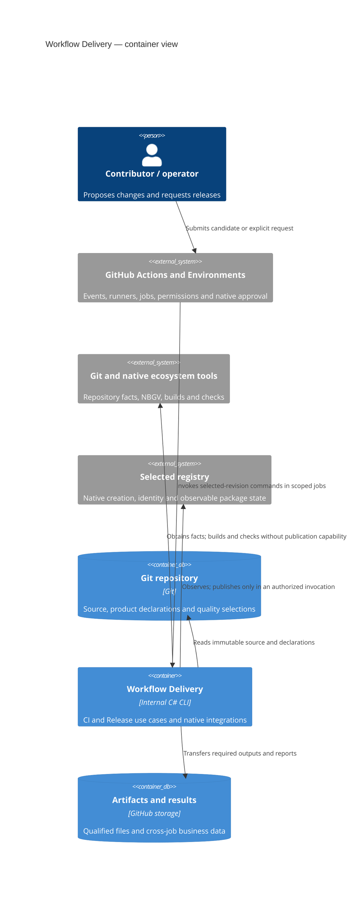

# Workflow Delivery v3 High-Level Design

## Status and Scope

This is the replacement architecture for the repository-internal contraction.
It realizes the [requirements](./requirements.md) and the owner's architecture
decisions. The implementation has not been cut over to this design. Acceptance
of this document does not claim implementation conformity, native publication
validation or permission to reopen a completed campaign.

The [middle-level design](./middle-level-design.md) owns the component,
selection, execution, transfer and outcome contracts for this architecture.
The [implementation plan](./migration-strategy.md) maps concrete projects/callers,
integration contracts and retirement dependencies.
The [Wave](../../../../../docs/delivery-wave.md) authorizes the bounded work;
the [handoff](./agent-handoff.md) retains operational limits. The
[pinned former MLDs and migration plan](./README.md#normative-hierarchy),
old glossary and ecosystem LLDs describe the existing
runtime and its evidence consumers under the
[requirements transition](./requirements.md#requirements-and-implementation-transition).
Their aggregate models and record chains are not contracts for this replacement.
The [previous HLD][previous-hld] remains available for those historical readers.

## Architecture and Responsibilities

One repository-internal C# CLI implements CI and Release use cases. Shared code
adapts native repository facts, builds, checks, package inspection and platform
clients where behavior is actually shared. Ecosystem-language helpers may call
their native libraries; the C# entry point does not require translating those
libraries' behavior into C#. CI and Release have different
responsibilities; they need no symmetric planners, finalizers, aggregates or
record hierarchies. Ordinary functions express planning and result evaluation.

The initial application location is `src/private/app/workflow-delivery/`, with
one test project under `tests/private/app/workflow-delivery/`. Modules are source
organization inside that application, not independently deployed services or a
public framework. Additional projects need a concrete dependency or runtime
reason. Documentation remains in this project namespace during the design
transition; relocation must move its actual consumers and navigation together.

The following C4 container view shows applications and stores. CLI invocations
are short-lived processes on Actions runners, not a persistent service.



| Responsibility                                           | Owner                                                         | Deliberate limit                                              |
| -------------------------------------------------------- | ------------------------------------------------------------- | ------------------------------------------------------------- |
| Candidate scope and required CI result                   | CI use case                                                   | Does not authorize Release                                    |
| Complete product preparation and request completion      | Release use case                                              | Does not adopt CI qualification or artifacts                  |
| Project/dependency facts, versions, builds and consumers | Ecosystem integrations                                        | Does not replace native build scheduling or version authority |
| Coordinates, observation, upload and readback            | Destination integrations                                      | Does not simulate missing registry guarantees                 |
| Execution, waiting, permission and approval              | Actions, Environments and destination publisher configuration | No application approval mirror or dynamic admission authority |
| Dependency and compiler caches                           | Native build tools and platform cache facilities              | No general V3 cache or intermediate-output reuse service      |

CI control comes from the exact candidate revision. Release control and product
source come from the selected release revision. The publisher uses a prepared
CLI artifact from that control revision, with its actual producer and integrity
binding checked at transfer. It does not build the CLI while holding publication
credentials. An authorized control-code writer is inside this trust boundary;
application checks do not confine a malicious accepted writer's effective token.

## Repository Facts and Selection

### Domain Values

| Value                   | Meaning and consumer                                                                                        |
| ----------------------- | ----------------------------------------------------------------------------------------------------------- |
| Project                 | Native build/package unit, including non-published dependencies; used for ownership, impact and checks      |
| Release unit            | Independently versioned product with explicit native entry points and complete publishable variants         |
| Candidate               | Exact tree tested by CI and the event-appropriate comparison basis                                          |
| Release request         | One release unit, full source commit, channel, destination and explicit live/dry-run mode                   |
| Selected work           | Projects, variants, required/advisory checks and real prerequisites, with selection reasons                 |
| Qualified output set    | Release's complete files, native coordinates, source/version bindings and successful required qualification |
| Destination observation | Required native state: absent, exact, partial, conflicting or unknown                                       |
| Release result          | Business satisfaction, attempted effects, command outcomes, verification and uncertainty                    |

These are values, not a required set of persistent aggregates. Product version,
source commit and execution are distinct facts. Different commits can share an
NBGV version without equal bytes or a global version-to-commit index.

### Native Facts and Declarations

Read native project membership, references, package identities, version inputs
and shared build inputs. Release-unit declarations add product boundaries,
variants and entry points. Explicit relations cover cross-ecosystem/generated
dependencies unavailable from native tools. Project quality YAML selects checks.
Do not reauthor native facts as a second manifest or compile dynamic Governance
into this model.

CI needs enough ownership and reverse-dependency information to identify affected
projects and transitive consumers. Release resolves the requested unit's complete
build/input and qualification closure; it need not execute unrelated projects
to compile a universal repository model. Native evaluation that executes project
code runs in the unprivileged build context.

Impact selection starts with the event's correct base and candidate, maps changed
paths to owners and shared-input consumers, closes dependency effects, then
selects release units and checks. Deletions and renames need ownership facts from
the comparison basis as well as the candidate. Changed dependency declarations
must not hide affected consumers.

Select all required variants of each affected unit. Global inputs and native
workspace/aggregate boundaries may broaden execution with an explanation.
Unknown ownership, missing dependencies, failed evaluation and unsupported
relevant structures fail planning; they do not silently trigger a full run.
Explicit full validation is a separate mode and states its supported coverage.
Excluding known-unrelated work is part of correctness, not optional optimization.

### Project Quality Autonomy

Retain project YAML selection and ecosystem presets. The current implementation
selects a preset per ecosystem; this design does not introduce a new composition
language or remove existing configuration capabilities. Selecting existing
checks is configuration. New native execution behavior may need implementation.

A stronger required baseline has an identifiable revision and explicit project
adoption. Projects can adopt gradually; equivalent implementation fixes need no
policy version change. Required and advisory results stay distinct. There is no
policy migration service or mandatory monorepo-wide baseline upgrade.

HK owns source/configuration conformance. CI owns project unit, scenario and
integration checks. The tool's own tests have one ordinary CI owner and are
selected by actual inputs and dependencies. Smoke packages follow the same
dependency and quality rules as other projects.

## Native Integrations

Native ecosystem libraries and supported tool interfaces own manifest and
configuration interpretation, project evaluation, dependency resolution,
version computation and package-format semantics. Ecosystem integrations invoke
those interfaces and project their results into the facts needed by Workflow.
This boundary applies to ecosystem-specific helpers as well as shared code.
Do not implement a second parser or resolver, fill missing native facts with
protocol-prefix heuristics, or replay a native evaluator's rules in another
language. Workflow owns impact selection, its quality and unit declarations,
request constraints and business result evaluation.

Before implementing an integration, identify the native interface and verify
that its output supports the required scope and errors. A successful call does
not imply that a partial listing covers the whole required dependency graph.
If a necessary capability is unavailable, stop the dependent work and present
the gap and tradeoff to the owner; do not compensate with application machinery
or silently reduce the required behavior.

Ecosystem integrations also invoke builds, package inspection and clean
consumption. Destination code owns endpoint/coordinate
semantics, observation, supported upload and interpretation of remote state.
Release owns completion and whether another mutation is allowed.

Use concrete implementations and static registration for supported combinations.
Separate responsibilities where callers need them, without an interface for
each noun, a universal optional-method adapter or a Cartesian plugin framework.
Adding a special project can require an explicit implementation; this is an
accepted extension cost.

| Ecosystem | Build and qualification                                    | Destination consequence                                                                                         |
| --------- | ---------------------------------------------------------- | --------------------------------------------------------------------------------------------------------------- |
| npm       | Native NBGV projection, original archive and clean install | Exact version state; tags are routing metadata; no lifecycle scripts with publication capability                |
| NuGet     | MSBuild/NBGV, original nupkg and clean restore/consumer    | Native package identity and archive state; no npm tag assumptions                                               |
| Python    | nbgv-python, wheel and sdist, clean consumers of both      | Complete two-file set; verified exact subsets may permit missing-file completion under the destination contract |
| Ruby      | Native version/gem build, metadata and installed consumer  | Evaluate gemspecs unprivileged; destination-specific original-gem observation and upload                        |

Each destination contract states normalization, required files, native
non-overwrite behavior, readback, visibility/time bounds, credential scope and
partial-set behavior. Missing necessary guarantees leave the path unsupported;
tests or application locks cannot supply them. Existing ecosystem evidence keeps
its original scope. This table is not new support or publication authorization.

### Versions, Original Bytes and Provenance

Planning obtains the expected native NBGV projection. Builds may invoke NBGV
again with the same target, relevant Git history/ref, version configuration,
dependency inputs and supported toolchain. Compare the required package/assembly
version projections with the selected values. Missing native facts block the
operation; no invented version or ambient fallback is allowed.

Retain deterministic build configuration: stable source and generated-source
paths, appropriate package timestamps, dependency locks and toolchain inputs.
Routine releases need not build twice. Native caches remain the build system's
concern. An isolated source-distribution build may need native static version
materialization; normal NBGV support does not require Git inside every downstream
source-archive consumer.

Preserve native provenance appropriate to the package: assembly source
information, package repository metadata or supported platform attestations.
Do not require an identical commit field across ecosystems or a V3 package
witness. Configure and inspect the chosen carrier; availability is not automatic.
Provenance does not replace required destination byte/state comparison.
Different-commit packages may differ despite equal versions.

The [feasibility record](./research/contraction-feasibility.md) retains unadmitted
local author observations separately from accepted assumptions. Those observations
do not supply admitted empirical justification for this owner-selected design.
The owner chose to skip a separate Windows
feasibility run and proceed assuming native NBGV and the combined helpers are
viable there. This is not a passed Windows observation or a deferred experiment
gate. Actual failures in ordinary implementation or CI still require correction
or explicit disposition.

## Execution and Permission Boundaries

Workflows have a static phase structure. Planning supplies selected lists and
native matrices, not an arbitrary runtime graph or general queue. Native build
tools own compilation ordering in their project graph. Workflows express actual
inter-job prerequisites.

Jobs/processes separate publication permissions, project-code execution,
runner/toolchain needs and transfers with independent lifetime. An internal
method or conceptual phase does not require a job, record or proof. General C#
builds continue on Windows unless a declared variant selects another runner;
Python and JavaScript/TypeScript may use Ubuntu. Runner choices do not require
matching CI and Release graphs.

Project evaluation, build, package scripts and consumers run without publication
capability and cannot mutate the publisher's execution context. The publisher
receives selected control, required request data and qualified files through
their transfer contracts. Building first and then adding write credentials to
the same product-mutated job is insufficient isolation. Metadata readers must
not execute product code in that privileged context.

Environment protections, workflow permissions and destination trust configuration
own authorization. Effective native approval, including permitted bypass, is
the policy. Do not maintain reviewer inventories, deployment-history proofs,
protected-path touch histories or an extra authorization certificate. Native
cancellation/revocation has its real limits; unrelated repository changes do
not invalidate the selected in-flight revision.

## CI Journey

1. Resolve the exact candidate and event comparison basis. Obtain required native
   facts in their appropriate execution context.
2. Select affected work and explain its dependency reasons. Close all required
   variants and project checks before execution.
3. Execute builds/checks using native tools and runner matrices without
   publication capability. HK retains its conformance responsibility.
4. Join candidate-bound results and publish the applicable GitHub check and
   explanation. Every required result must pass. Absent, skipped, cancelled,
   unknown or conflicting required work cannot pass. Advisory results remain
   visible without being relabeled as required failures.

Superseded candidate work may be cancelled. Finalization is an ordinary result
operation that accounts for failed dependencies, not a verdict database or
independent CI record genealogy.

## Release Journey

Buddy, Official and dry run share preparation and qualification code. Buddy can
publish from allowed development refs. Official live publication requires an
eligible reviewed official branch/tag, such as configured `release/*` refs.
Dry run can use development revisions and their release code without write
capability; live ref restrictions do not block it.

1. Resolve one immutable source/control revision, unit, destination and mode.
   Select its native version, complete outputs and quality obligations. Reject
   unsupported live reruns and invalid live channel/ref combinations.
2. Independently build and qualify Release's complete set, including package
   contents and clean consumers. CI results cannot substitute.
3. Observe the destination with public or minimally scoped read access. Compare
   qualified files with native state and classify intended work. Dry run reports
   hypothetical operations and its actual validation boundary, then stops with
   no mutation or live-completion claim.
4. If exact complete state and applicable verification/consumer conditions hold,
   report satisfaction without a write gate. If a write remains, retain and
   expose target, native coordinate, complete outputs, destination and intended
   operations before the native gate.
5. In the authorized publisher context, consume the qualified request, check
   current destination state and acquire supported short-lived write capability
   when needed. A changed plan cannot enlarge the reviewed request. Exact state
   can remove a now-unnecessary write; conflict/unknown state blocks it. Execute
   supported operations in order; ambiguity stops further mutation. No separate
   pre-mutation marker or marker readback is required.
6. While execution is active, perform bounded required verification. Report
   command outcomes, business completion and uncertainty separately. Package
   consumers run outside the privileged publisher context. Missing required
   verification prevents a satisfaction claim.

```mermaid
sequenceDiagram
    actor Operator
    participant Prep as Unprivileged Release preparation
    participant Registry
    participant Gate as Native Environment / permissions
    participant Publisher as Isolated publisher
    participant Verify as Verification and result
    Operator->>Prep: Unit, revision, channel, destination, mode
    Prep->>Prep: Native build and complete qualification
    Prep->>Registry: Read required state
    Registry-->>Prep: Exact, absent, partial, conflict or unknown
    alt Dry run
        Prep-->>Operator: Simulation and hypothetical operations
    else Exact complete state
        Prep->>Verify: Qualified request and current observation; no write
        Verify->>Registry: Required verification / unprivileged consumers
        Verify-->>Operator: Satisfaction and known effects
    else Supported write remains
        Prep->>Gate: Qualified request and intended operations
        Gate->>Publisher: Native authorization permits job
        Publisher->>Registry: Reobserve; perform only still-needed writes
        Publisher->>Verify: Actual command outcomes and known effects
        Verify->>Registry: Required bounded readback / unprivileged consumers
        Verify-->>Operator: Satisfaction, command results and uncertainty
    else Conflict, unknown or unsupported partial state
        Prep-->>Operator: Blocked request and reason
    end
```

### Completion and Recovery

| Observation in the active request                                            | Business result and next action                                                                                         |
| ---------------------------------------------------------------------------- | ----------------------------------------------------------------------------------------------------------------------- |
| Complete exact state and every required check satisfied                      | Satisfied; distinguish acknowledged upload from completion established by observation                                   |
| Upload success but missing required state/consumer verification              | Unsatisfied or unknown; retain the successful command result                                                            |
| Upload failed/lost response but complete authoritative verification succeeds | Satisfied by observed state; preserve command failure/ambiguity and do not claim this invocation created the objects    |
| Verified exact subset and adapter supports completion                        | Only missing files may be planned in a fresh recovery request; no generic partial-release repair                        |
| Conflicting bytes or unknown required state                                  | No further mutation; explain uncertainty and supported operator action                                                  |
| Interrupted publisher or missing required result                             | Effects remain possibly unknown unless native facts prove non-start; missing application records do not prove non-start |

Recovery uses a fresh manual dispatch at the original source/control revision
and relevant inputs, rebuilds, qualifies and observes anew. It obtains current
native authorization for remaining writes. It does not reuse approval, promote
old files, enumerate all historical runs or relabel a terminal failure. A control
fix is a new revision, not permission to combine latest tooling with an older
target. Exceptional administration needs a separate operator decision and native
operation; there is no general repair service.

### Concurrency

Use Actions concurrency to serialize this repository's publication work for a
physical registry and normalized package. Keep read-before-write and necessary
verification in the serialized operation. Do not partition colliding coordinates
solely by channel/version. A newer request does not automatically cancel live
publication. Pending requests may be rejected/coalesced within native semantics;
FIFO, fairness and lossless enqueueing are not promised.

External writers remain subject to registry guarantees. Observation,
non-overwriting creation and duplicate/conflict handling determine outcomes;
Actions concurrency is not a global lock. Python's ordered wheel/sdist uploads
do not imply atomic sets or cross-registry transactions. No general
mutable-resource-set scheduler is introduced.

## Data Crossing Boundaries

Persist information for a concrete transfer, permission or interruption/recovery
consumer. Inside a trusted invocation, ordinary typed values suffice.

| Boundary consumer               | Necessary information                                                                                                      | Required check                                                                                   |
| ------------------------------- | -------------------------------------------------------------------------------------------------------------------------- | ------------------------------------------------------------------------------------------------ |
| Executor in another job/process | Candidate/request target, selected work, inputs, native versions and required checks                                       | Execute selected scope and return results for that subject                                       |
| Review and publisher            | Complete qualified files, coordinates, source/control revision, destination, intended operations and qualification results | Bind actual artifacts to request and qualification; reject missing/substituted/mismatched inputs |
| Platform artifact transfer      | Intended immutable artifact identity and relevant producer/integrity information                                           | Use native identity/integrity; no display-name/latest fallback                                   |
| Result consumer                 | Attempted effects, actual command results, remote facts, verification and uncertainty                                      | Keep execution facts separate from satisfaction; missing data cannot prove no effects            |
| Operator                        | Scope, outcome, diagnostic reasons and supported next action                                                               | Preserve terminal outcomes; later requests cannot rewrite them                                   |

This does not require one file per row, a universal envelope, recursive digest
chains, approval certificates, a durable attempt aggregate or a record engine.
Concrete JSON fields and command signatures follow actual implementation
consumers. Internal formats may break; callers change or retire together without
mandatory historical readers in the new core.

Retain qualified files and required request/results through native approval waits
and the supported operation window. Concrete retention belongs in workflow
integration; expired required inputs block that operation. Native observation
may suffice for a fresh request where its contract permits. Optional telemetry
failure does not undo an established result; missing required completion evidence
leaves uncertainty. No permanent ledger or mandatory per-product GitHub Release
is added.

## Implementation and Retirement Order

Confirm this architecture and affected boundary contracts/validation basis, then
implement directly in the final private application location. Do not first move
the old Python framework and then port all its abstractions.

Introduce the native fact/impact and build/check code needed for the first
complete CI journey. Complete common Release preparation, dry run and
destination/result contracts before switching their callers. Cut over bounded
complete journeys, with one active authoritative path each. Temporary comparison
execution is explicitly non-authoritative. Dependencies drive this order; there
is no obligation to keep two long-lived systems.

Consolidate provider and native-consumer helpers as internal modules, retaining
actual process boundaries. Retire the static-reference scanner and its admission
callers. Keep real ecosystem manifests and consumer projects as fixtures without
special trust. The independently useful `nbgv-python` remains public. Necessary
native fixtures do not contradict the one-application/one-test starting point.

Switch or retire workflow/CLI callers, tests, schemas and dependencies with each
journey. There is no old-format/API compatibility requirement. Preserve original
historical outcomes and provenance required by current readers, without creating
a legacy replay product. Retire old design/implementation carriers when their
last concrete consumer is gone; five MLDs are not a target-design requirement.

## Validation Basis and Remaining Design Work

Scenario tests cover selected CI and complete variants/checks, development dry
runs, Buddy/Official eligibility, exact-state completion, supported missing-file
recovery, conflict and interruption. Focused unit tests protect impact closure
and outcome classification; contract tests protect real transfers. Exercise
native integrations where needed, without re-proving platform authorization or
scheduling guarantees.

Selection validation includes unrelated changes, shared inputs, deletion/rename,
transitive effects and failed analysis. Measure the ordinary-PR 12-minute
objective separately from legitimate broad changes; fast full execution is not
successful impact selection. Package validation covers native versions, complete
files, clean consumption and same-input reproducibility without cross-commit or
old/new-format byte equality.

The [middle-level design](./middle-level-design.md) closes common selection,
quality, package/consumer, Release-state and transfer behavior. Before each
implementation scope, specify concrete command/transfer fields, native fact
extraction coverage, destination completion conditions/read bounds, runner mapping
and retention. Validate/review them with their caller group. These are bounded
implementation contracts, not new frameworks or automatic owner questions.
New behavior, trust-boundary or material scope/cost conflicts return for owner
disposition.

The Windows assumption is accepted for proceeding; no separate feasibility
campaign is scheduled. Normal changed-code validation remains. Completed live
campaigns stay closed, and documentation grants no new publication, credential,
Environment or account operations.

## Requirement Coverage

| Requirements    | Owning design                                                                                |
| --------------- | -------------------------------------------------------------------------------------------- |
| WD-SYS, WD-AUTH | Internal CLI, distinct use cases, selected-revision control and native authorization         |
| WD-CI           | Native facts, meaningful impact selection, quality autonomy and complete CI result           |
| WD-REL, WD-CHN  | Shared Release journey, independent qualification, native versions and channel/mode behavior |
| WD-SEC          | Project-code isolation, qualified transfers and build-free publisher                         |
| WD-OPS          | Destination contracts, truthful completion, same-revision recovery and native provenance     |
| WD-EVD, WD-RET  | Consumer-specific data, required retention and uncertainty                                   |
| WD-CON          | Static Actions phases and registry/package concurrency within native guarantees              |
| WD-NFR          | Scenario validation, explainable results, explicit integration cost and selective CI latency |

[previous-hld]: https://github.com/hcoona/three/blob/c56b1efa64637f056b63a497aabbdaf33c1fbf1f/src/public/lib/three-workflow-delivery-v3/docs/high-level-design.md
